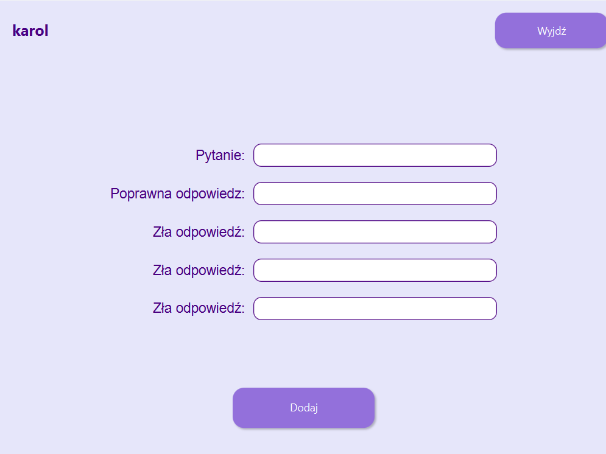

# Twórca Quizów

Twórca Quizów to aplikacja okienkowa w Javie, umożliwiająca tworzenie, rozwiązywanie oraz zarządzanie quizami. Użytkownik może łatwo dodawać nowe pytania, odpowiadać na quizy oraz przeglądać ranking wyników.

## Zrzuty ekranu

## Funkcjonalności
* Tworzenie quizów: Umożliwia dodawanie nowych quizów z pytaniami i odpowiedziami.
* Rozwiązywanie quizów: Użytkownik może odpowiadać na pytania i otrzymywać natychmiastowy wynik.
* Ranking: System rankingowy przechowuje i wyświetla wyniki graczy.

## Technologie
* Java – Główny język programowania.
* JavaFX – Biblioteka użyta do tworzenia interfejsu graficznego
* SQLite – Mechanizm przechowywania danych
